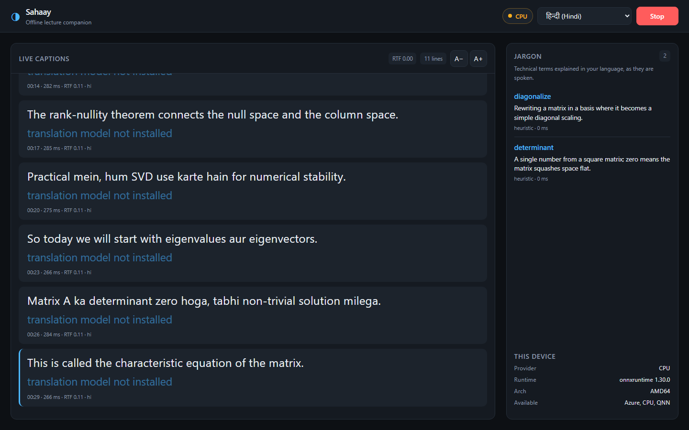

# Sahaay

**Live lecture captions, Indian-language translation and a jargon glossary — running entirely on a Snapdragon-powered HP PC, with the network off.**

Submitted to the Snapdragon® AI Lab Build & Present Challenge 2026.

---

## The problem

An engineering lecture in India is rarely in one language. It sounds like this:

> "Matrix A ka **determinant** zero hoga, tabhi non-trivial **solution** milega."

A student following that in their second language has two problems at once. They have to parse a Hindi sentence, and they have to recognise the English technical terms inside it — the exact terms that will appear in the textbook and the exam.

Cloud captioning handles this badly and costs money per minute. It also needs connectivity that a lecture hall, a hostel room, or a rural college often does not have. And a student who is deaf or hard of hearing cannot wait for a laggy cloud round-trip mid-sentence.

## What Sahaay does

Three things, live, while the lecture is happening:

1. **Captions** the lecturer — capturing both the microphone and whatever is playing through the speakers, so an in-person class and a Zoom lecture both work with no setup.
2. **Translates** each line into one of eight Indian languages, while *protecting* the technical terms so "eigenvalue" stays "eigenvalue" instead of becoming a transliterated guess.
3. **Explains the jargon** as it is spoken. When the lecturer says "eigenvalue", a one-line explanation appears in the student's language, in the sidebar, without them leaving the lecture to search for it.

When the session ends it writes structured notes, a glossary and a five-question self-test to a Markdown file.

Nothing leaves the device. There is no account, no API key, and no network call in the entire audio path.

## Why this needs an NPU

This is the part that makes it a Snapdragon application rather than a Python app that happens to run on one — and it is measured, not asserted.

Sahaay runs **two models concurrently and continuously for the length of a lecture**: Whisper transcribing every few seconds, and Llama 3.2 generating glossary entries alongside it. Here is what the second one costs the first, on a CPU:

| Whisper latency | Mean | p95 | Real-time factor |
|---|---:|---:|---:|
| Glossary idle | 343.7 ms | 374.3 ms | 0.043 |
| **Glossary running** | **2390.7 ms** | 3063.9 ms | **0.299** |

**Captions get 7× slower.** Not a tuning problem — two compute-bound models on one set of cores, and the captions the user is reading in real time are what loses.

On a Snapdragon PC the Whisper encoder runs on the Hexagon NPU instead: [13.5 ms on X2 Elite, 129 of 129 layers on the NPU](docs/AIHUB.md). The two models sit on separate silicon and the contention above disappears. Method and full numbers in [docs/CONCURRENCY.md](docs/CONCURRENCY.md).

A one-hour lecture, every day, for every student, is also precisely the workload that is absurd to send to the cloud — and precisely what a 45 TOPS NPU sitting idle in a laptop is for.



*Captions arriving live, the jargon sidebar filling as terms are spoken, and the execution-provider badge reporting what the models are actually running on. Translation shows "not installed" here because this capture ran without the NLLB weights — the UI never claims a capability it does not have.*

## Try it in 30 seconds

No models, no audio device, no Snapdragon hardware:

```powershell
git clone https://github.com/andringodson/sahaay
cd sahaay
powershell -ExecutionPolicy Bypass -File install.ps1
.\run.bat --mock
```

A browser opens with a scripted code-mixed lecture running through the real pipeline — the same event plumbing, UI, glossary and notes writer the production path uses.

For the real thing:

```powershell
.\.venv\Scripts\python.exe scripts\download_models.py --auto
.\run.bat
```

Then play any lecture and press **Start**.

## Something not working? Ask it

```powershell
.
un.bat --selftest
```

```
  + onnxruntime               version 1.30.0
  ~ Hexagon NPU               CPU (QNN present but bound to CPU...)
                              -> Expected on any non-Snapdragon machine
  + live caption transport    websockets
  x speech recognition        no Whisper weights found
                              -> python scripts/download_models.py --asr
  ~ translation               captions will not be translated
                              -> python scripts/download_models.py --translate
  + end-to-end pipeline       2 captions in mock mode

  3 ok, 5 degraded, 1 failed
```

Three states, and the distinction is deliberate: **degraded** means missing
with a documented fallback, **failed** means the app will not work. A missing
NPU is degraded — the product is designed to run without one. Missing Whisper
weights are a failure, because there is no captioning without them. Every
non-ok line says what to do about it.

## Is it actually using the NPU?

Ask it:

```powershell
.\run.bat --device
```

```
  Sahaay device report
  ----------------------------------------------
  Execution provider : Hexagon NPU (QNN)
  ONNX Runtime       : 1.30.0
  Architecture       : ARM64 (ARM64)
  Available providers: QNNExecutionProvider, CPUExecutionProvider
  Hexagon NPU active : yes
```

The same information is a live badge in the UI. It reports the provider that ONNX Runtime actually bound to — not what the config asked for.

**It will tell you "no" when the answer is no.** On the x86 machine this was developed on, it prints:

```
  Execution provider : CPU
  Hexagon NPU active : no
  Fallback reason    : QNN present but bound to CPU, so there is no Hexagon NPU here
```

That distinction is not cosmetic, and finding it was the single most valuable hour of this build — see [the hardware notes](docs/HARDWARE.md).

## Architecture

```
  microphone ─┐
              ├─► 16 kHz mono ─► Silero VAD ─► segment on pause
  speakers ───┘    (WASAPI)        (CPU)              │
   (loopback)                                         ▼
                                            ┌──────────────────┐
                                            │  Whisper Small   │  NPU
                                            │  w8a16 QNN       │
                                            └────────┬─────────┘
                                                     │ caption
                                    ┌────────────────┼────────────────┐
                                    ▼                                 ▼
                          ┌──────────────────┐            ┌──────────────────┐
                          │  NLLB-200 600M   │  NPU       │  Llama 3.2 3B    │  NPU
                          │  INT8            │            │  glossary, low   │
                          └────────┬─────────┘            │  priority        │
                                   │                      └────────┬─────────┘
                                   ▼                               ▼
                             translation                     jargon sidebar
                                   └───────────┬───────────────────┘
                                               ▼
                                   session notes + self-test (Markdown)
```

Details in [docs/ARCHITECTURE.md](docs/ARCHITECTURE.md).

### Models

| Stage | Model | Precision | Source |
|---|---|---|---|
| VAD | Silero VAD | fp32 | [onnx-community/silero-vad](https://huggingface.co/onnx-community/silero-vad) |
| ASR | Whisper Small | w8a16 | [qualcomm/Whisper-Small-Quantized](https://huggingface.co/qualcomm/Whisper-Small-Quantized) — Qualcomm AI Hub, validated on Snapdragon X Elite |
| ASR (portable) | Whisper Small / Tiny | int8 / fp32 | [onnx-community](https://huggingface.co/onnx-community) — the x86 fallback these tests ran on |
| Translation | NLLB-200 distilled 600M | int8 | [Xenova/nllb-200-distilled-600M](https://huggingface.co/Xenova/nllb-200-distilled-600M) |
| Glossary + notes | Llama 3.2 3B Instruct | Hexagon assets | [onnx-community/Llama-3.2-3B-instruct-hexagon-npu-assets](https://huggingface.co/onnx-community/Llama-3.2-3B-instruct-hexagon-npu-assets) |
| Glossary (portable) | Llama 3.2 3B / 1B Instruct | int4 | [GENAI-ONNX builds](https://huggingface.co/onnx-community/Llama-3.2-3B-Instruct-GENAI-ONNX) — ship `genai_config.json`, which plain ONNX exports do not |

**Which glossary model gets used depends on the hardware.** Measured on x86 CPU: the 3B runs at 7.4 tok/s against the 1B's 16.9, and needs ~3.5 GB resident — under memory pressure one 146-token call took 35 minutes. So with the NPU active the 3B is preferred for its better explanations; on CPU the 1B is, because a glossary entry that arrives after the lecture has ended is not a glossary entry.

No weights are vendored. `scripts/download_models.py --auto` picks the Snapdragon or portable tier by architecture.

## It degrades instead of breaking

Every stage has a fallback, so the app is reviewable on any machine:

| If this is missing | What happens |
|---|---|
| Hexagon NPU | DirectML, then CPU. Same code path. |
| `onnxruntime-genai` or the LLM | Glossary uses a seeded STEM vocabulary + morphology filter |
| NLLB weights | Captions still work; the UI says translation is not installed |
| Silero VAD | Adaptive energy gating with a tracked noise floor |
| Everything | `--mock` runs the full pipeline on a scripted transcript |

The UI never claims a capability it does not have. A passthrough translation says so rather than showing English text under a Hindi heading.

## What has actually been verified

Claims in a hackathon README are cheap, so here is exactly what was run, and
on what.

The pipeline was tested end to end against **real model weights** and **real
speech** with known ground truth — audio generated via Windows SAPI so the
expected transcript is known in advance, rather than judged by ear.

| Stage | Result |
|---|---|
| Silero VAD → segmentation | 3 spoken sentences → **exactly 3 segments**, boundaries correct |
| Whisper → transcript | **word-for-word correct** on all three sentences |
| NLLB → Hindi/Tamil/Telugu/Malayalam | fluent output in all four |
| Term protection | `eigenvalues`, `eigenvectors`, `determinant`, `SVD`, `backpropagation` **survive in Latin script inside a Devanagari sentence** |
| Llama → glossary | real Hindi explanations of code-mixed terms, 24 tok/s on CPU int4 |
| Llama → notes + quiz | structured Topics / Key points, and real Q&A pairs |
| Full pipeline | audio in → captions → translation → glossary → saved notes |
| **Accuracy** | **0.0% WER** on English, **14/14 technical terms kept** — [docs/ACCURACY.md](docs/ACCURACY.md) |
| **Concurrency** | glossary costs captions **7×** on CPU — [docs/CONCURRENCY.md](docs/CONCURRENCY.md) |
| Local web server | real models load, EP badge live, WebSocket feed correct |

Example, straight out of the run:

```
CAPTION: So today we will start with eigenvalues and eigenvectors.
     HI: तो आज हम eigenvalues और eigenvectors के साथ शुरू करेंगे।
   kept: ['eigenvalues', 'eigenvectors']
```

The Whisper encoder has additionally been run on **real Snapdragon hardware**
via Qualcomm's device farm — see the table above and [docs/AIHUB.md](docs/AIHUB.md).

**What has *not* been verified:** the full three-model pipeline end to end on a
physical Snapdragon PC. Individual graphs were profiled there, but wall-clock
numbers for the whole pipeline come from the x86 machine, and
[docs/BENCHMARKS.md](docs/BENCHMARKS.md) says so on every row. Word error rate
is measured, but against **synthesised** speech ([docs/ACCURACY.md](docs/ACCURACY.md)) —
real-speaker accuracy needs a labelled code-mixed corpus and is still unknown.
Both the 1B and 3B glossary
models have now been run; the 3B writes visibly better explanations, and the
app picks between them by hardware (see below).

## Performance on real Snapdragon silicon

These are measurements on physical Snapdragon hardware from Qualcomm's own
device farm — not datasheet figures, not estimates. **Every job link is
public; open one and check the number.**

| Whisper encoder | On-device | Peak memory | Layers on NPU |
|---|---:|---:|---:|
| Snapdragon X Elite | 27.48 ms | 16.9 MB | **129 / 129** |
| **Snapdragon X2 Elite** | **13.5 ms** | 9.2 MB | **129 / 129** |
| Snapdragon X Plus 8-Core | 26.71 ms | 16.2 MB | **129 / 129** |

**129 of 129 layers ran on the Hexagon NPU** — Qualcomm's profiler reports
zero CPU fallback for the entire graph. Full table and job links in
[docs/AIHUB.md](docs/AIHUB.md).

[docs/BENCHMARKS.md](docs/BENCHMARKS.md) covers the x86 development machine and the CPU fallback path, generated by `scripts/bench.py` on the machine that ran it — nothing typed in by hand. It reports p95 alongside the mean, because a captioner with a 200 ms mean and a 3 s p95 feels broken.

```powershell
python scripts\bench.py --compare --write
python scripts\aihub_profile.py --all --write
```

## Accessibility

The primary user may be reading the lecture rather than hearing it, so this is treated as a feature area, not a checkbox:

- Caption text size is adjustable and remembered per viewer
- High-contrast dark theme by default, light theme honoured from the OS
- Captions are an `aria-live` region so a screen reader announces new lines
- `prefers-reduced-motion` disables the caption animation and smooth scroll
- Space toggles start/stop; Escape closes the notes sheet
- The whole UI is keyboard reachable with visible focus rings

## Privacy — proven, not asserted

- The server binds to `127.0.0.1` only — never the LAN
- No telemetry, no analytics, no accounts, no API keys
- Audio is never written to disk; only the transcript you chose to save
- Sessions go to `sessions/` as plain Markdown you can read, move or delete

`tests/test_offline.py` **enforces** this. It monkeypatches `socket` so any
connection or DNS lookup to anything but loopback raises, then runs a full
session — segmentation, ASR, translation, glossary, notes — and asserts
nothing tried. The guard self-tests first, because a guard that never fires
proves nothing. Nothing under `sahaay/` may import an HTTP client at all.

```
$ pytest tests/test_offline.py
12 passed
```

## Development

```powershell
powershell -ExecutionPolicy Bypass -File install.ps1 -Dev
.\.venv\Scripts\python.exe -m pytest        # 199 tests, no weights required
```

```
sahaay/
  runtime.py     execution-provider selection — the Snapdragon-specific part
  features.py    Whisper log-mel front end, pure NumPy
  audio.py       WASAPI loopback + microphone capture
  vad.py         Silero VAD and pause-based segmentation
  asr.py         Whisper inference (AI Hub and Optimum packagings)
  translate.py   NLLB with technical-term protection
  llm.py         Llama via ORT GenAI, with a heuristic fallback
  glossary.py    the jargon sidebar worker
  notes.py       session notes, glossary and quiz
  pipeline.py    the three-thread orchestrator
  server.py      FastAPI + WebSocket
  ui/            no framework, no build step
```

## Licence

MIT — see [LICENSE](LICENSE). Model weights carry their own licences.

## Acknowledgements

Built on [Qualcomm AI Hub](https://aihub.qualcomm.com/) models, [ONNX Runtime](https://onnxruntime.ai/) with the QNN execution provider, OpenAI Whisper, Meta's NLLB-200 and Llama 3.2, and [Silero VAD](https://github.com/snakers4/silero-vad).

## Submitting this

The presentation kit - slide outline, three-minute demo script and a
pre-recording checklist - is in [docs/PRESENTATION.md](docs/PRESENTATION.md).
